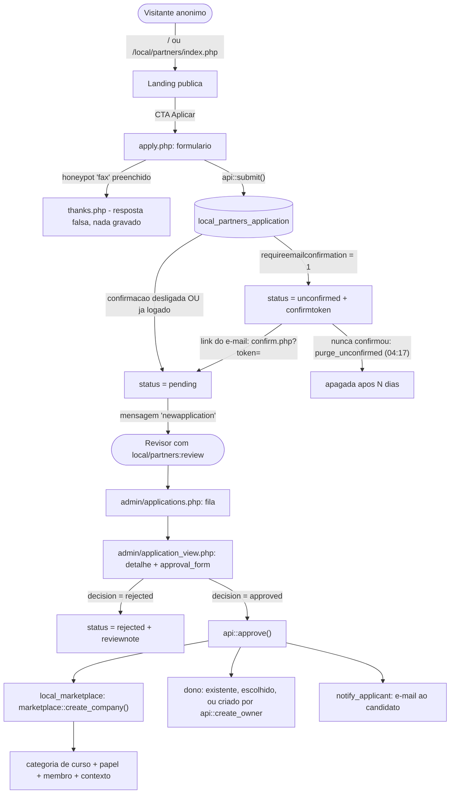

# Reforma visual do `local_partners` — landing e cadastro

> Plano aprovado em 09/09/2026 e executado na worktree `partners-visual`
> (branch `feature/partners-visual`, ramificada de `origin/dev`).

**A documentação vem antes do código.** A etapa 1 inteira é escrita: o plano
salvo com o nome certo, o novo `docs/dev/padrao-de-implementacao.md` e o roteiro
de validação com o esqueleto pronto. Só depois nasce o primeiro teste vermelho.
A razão é prática: o conhecimento levantado nesta investigação — os pontos do
core que foram verificados um a um, e as armadilhas que já custaram rodada
vermelha — se perde se ficar só no plano, que é registro de uma feature. O padrão
de implementação é o que sobrevive a ela.

## Contexto

O `local_partners` já existe, está em produção e tem 31 testes: landing pública
em `/local/partners/index.php`, formulário de candidatura em `apply.php`, fila e
aprovação em `admin/`, e a fachada `landing.php` que o `theme_ldg` chama para
servir a landing na home. O que ele **não** tem é aparência à altura.

O usuário disse, literalmente: *"o layout do plugin atual não gostei muito, por
isso quero melhorar"*. Mandou mockups prontos — HTML com Tailwind, PNGs de
desktop e de celular, e um design system completo em Markdown — e pediu o visual
deles portado para Bootstrap 5, responsivo, **funcionando também sob `theme_boost`
e `theme_moove`**, não só sob o `theme_ldg`.

Esse último requisito é o que torna a tarefa mais que troca de CSS: hoje **todo**
o estilo da landing mora em `public/theme/ldg/scss/ldg/_landing.scss`. Sob Boost
ou Moove a página sai crua. Corrigir isso rompe com a regra atual do projeto —
"o plugin entrega marcação, o tema pinta" — e essa ruptura é deliberada e
aprovada.

**Resultado esperado:** landing e cadastro com a cara dos mockups, idênticos nos
três temas, escuros por padrão com alternador claro/escuro, provados no navegador
em largura de celular e de desktop, com roteiro de validação em
`docs/data-validation/`.

## Decisões já tomadas — não revisitar

| # | Assunto | Decisão |
|---|---|---|
| 1 | Fluxo | **Continua candidatura + aprovação do admin.** O mockup sugeria autoatendimento ("Nome de Usuário", "Senha Provisória", "Criar Conta e Ativar Moodle"); foi descartado por contrariar *"Sem auto-atendimento para criar empresa"* do `CLAUDE.md`. Usuário e senha não entram. |
| 2 | Campos novos | **País/Região**, **Previsão de alunos ativos/mês** e **aceite de termos/LGPD**. O seletor de plano vira os cards de rádio do mockup. |
| 3 | CSS | **`styles.css` próprio do plugin**, escopado, com os tokens embutidos. O `_landing.scss` do tema encolhe para o chrome. |
| 4 | Paleta | **Escuro por padrão**, seguindo o design system da plataforma, **com alternador claro/escuro dentro da página** — o mockup não tem versão clara, ela será derivada e medida. |
| 5 | Chrome | Navbar e rodapé continuam sendo do tema. A landing ganha **barra de seções própria**, fina e sticky, com âncoras e o alternador de modo. |
| 6 | Marca | **Logo padrão da marca** (`theme/ldg/pix/logo.svg` e `logo_dark.svg`) e **hero padrão** (`local/partners/pix/hero.jpg`). Nada de asset novo. |

## Mapa de caso de uso e fluxo do processo



Três coisas desse fluxo que costumam ser mal-entendidas e ficam registradas aqui:

**A empresa não nasce no cadastro.** A candidatura é só uma linha numa tabela do
`local_partners`. A empresa — que é uma **categoria de cursos**, objeto global —
só existe depois que um humano com a capability aprova. É por isso que o mockup
foi recusado nesse ponto.

**A comissão não vem da candidatura.** `api::approve()` cria a empresa com
`'commissionpct' => null` de propósito, para que o **plano** governe a comissão.
O plano escolhido no formulário é interesse declarado, não contrato.

**O honeypot responde com sucesso falso.** Robô que preenche o campo `fax` é
redirecionado para o `thanks.php` sem nada ser gravado. Devolver erro ensinaria o
robô a acertar na próxima.

## Onde os dados ficam

Tabela única: **`local_partners_application`** (`db/install.xml`). Sem chave
estrangeira para `planid` — apontar para tabela de outro plugin faz o
`check_database_schema` reclamar; a integridade é garantida por
`application::validate_planid()` contra `local_marketplace\plan`.

### Colunas de hoje

| Coluna | Tipo | Papel |
|---|---|---|
| `companyname` | char255, NN | Nome da organização |
| `cnpj` | char14 | Validado por `local_marketplace\cnpj` |
| `contactname`, `contactemail` | char255, NN | Contato; o e-mail é a chave da duplicidade e da confirmação |
| `contactphone`, `website` | char30 / char255 | Opcionais |
| `planid` | int10 | Plano de interesse; `0`/nulo = "ainda não decidi" |
| `message` | text | Livre, teto de 2000 |
| `status` | char20, NN | `unconfirmed` → `pending` → `approved` \| `rejected` |
| `reviewnote`, `reviewerid`, `timereviewed` | text / int / int | Carimbo da decisão |
| `companyid`, `userid` | int10 | O que a aprovação produziu |
| `confirmtoken`, `timeconfirmed` | char32 / int10 | Confirmação por e-mail, uso único |
| `submitterip` | char45 | Base do limite de 3 por hora por IP |

### Colunas novas desta reforma

| Coluna | Tipo | Nulo | Razão |
|---|---|---|---|
| `country` | CHAR(2) | sim | ISO 3166-1 alpha-2, o mesmo alfabeto que a oferta do `local_marketplace` usa. Decide moeda e conta de split — não é enfeite de formulário. |
| `learnersband` | CHAR(20) | sim | `upto100`, `100to1000`, `1000to5000`, `over5000`. **Char e não int**: um inteiro remapeia em silêncio se a lista de faixas mudar. |
| `termsaccepted` | INT(10) | sim | **Momento do aceite, não um booleano.** Um `1` em toda linha é redundante com a existência da linha; o que tem valor probatório é *quando*. Anulável porque as candidaturas já na fila entraram antes de o aceite existir — retroagir com `1` inventaria um consentimento que ninguém deu. |

Passo em `db/upgrade.php` sob `if ($oldversion < 2026091000)`, três `add_field`
guardados por `field_exists`, e `version.php` de `2026090101` para `2026091000`.
O terceiro argumento de `xmldb_field` (o `$previous`) tem que bater com a ordem
do `install.xml`.

**Privacidade.** As três entram em `get_metadata()` e no export. No
`forget_submitters()`: `country` e `learnersband` **ficam** (são atributos da
operação, como `companyname` e `cnpj`), e `termsaccepted` **fica**, porque é o
registro de um ato jurídico — apagá-lo destruiria a prova de que a empresa
consentiu. Isso vai no docblock, escrito, porque é o tipo de decisão que alguém
desfaz por engano seis meses depois.

## Como aprovar a empresa

Nada disso muda nesta reforma; fica documentado porque o usuário pediu o mapa.

1. **Chegada.** Ao entrar na fila, o provider `newapplication` (`db/messages.php`)
   avisa por e-mail e popup todo mundo que tem `local/partners:review`.
2. **A fila.** *Administração do site* → página externa
   **`local_partners_applications`** → `public/local/partners/admin/applications.php`.
   Tabela com situação em badge, mais antiga primeiro.
3. **O detalhe.** `admin/application_view.php?id=N` mostra a candidatura inteira e
   o `approval_form`.
4. **A decisão.** `decision` = `approved` ou `rejected`. Com `rejected`, todos os
   outros campos somem (`hideIf`), e só o `reviewnote` importa.
5. **Aprovando**, o revisor confirma:
   - `shortname` da empresa — padrão vem de `api::suggest_shortname()`;
   - `ownerid` — autocomplete de usuário. Vazio ou zero faz `api::create_owner()`
     criar o dono a partir do `contactemail`, com `api::available_username()`
     resolvendo colisão de nome;
   - `planid` — o revisor pode corrigir o plano que o candidato declarou.
6. **O que `api::approve()` faz:** chama `marketplace::create_company()` — o
   **único** ponto de criação de empresa —, grava `companyid`/`userid`/`reviewerid`/
   `timereviewed` na linha, e notifica o candidato por `notify_applicant()`.
   `guard_pending()` recusa aprovar duas vezes.
7. **Depois.** A empresa aparece em `/local/marketplace/admin/company_edit.php`,
   já com categoria, papel e membro.

A capability `local/partners:review` tem `archetypes => []` **vazio de propósito**
— aprovar cria uma categoria global, e ninguém ganha isso por herança de papel.

## Arquitetura da reforma

### O CSS

Arquivo único: **`public/local/partners/styles.css`**. CSS puro — `styles.css` de
plugin não passa por compilador SCSS.

O mecanismo que faz isso funcionar nos três temas está verificado:
`public/lib/classes/output/theme_config.php:1156` varre todo tipo de plugin
atrás de `styles.css` e o injeta na CSS compilada de **qualquer** tema. Não é
preciso `$PAGE->requires->css()` nem cooperação do tema.

**Mas ele entra antes da CSS do tema** (ordem: `plugins` → `parents` → `theme`).
Em empate de especificidade o tema vence, e o `theme/ldg/scss/ldg/_forms.scss`
estiliza `.form-control` e `.btn-primary` com uma classe só. Por isso **toda**
regra carrega o escopo `.ldgp` — 0,2,0 contra 0,1,0, vence independentemente da
ordem. Uma única regra desescopada funciona sob Boost e some sob ldg, em silêncio.

Tokens em custom properties **em `.ldgp`, nunca em `:root`** — armadilha já
registrada em `theme/ldg/scss/ldg/_navbar.scss:60-64`: `:root` é o `<html>`, e o
atributo de modo é escrito em outro elemento.

```css
.ldgp,
.ldgp[data-bs-theme="dark"] {           /* escuro primeiro: e o padrao, e vale antes de qualquer JS */
    --ldgp-canvas: #121212;  --ldgp-card: #1e1e1e;  --ldgp-elevated: #2a2a2a;
    --ldgp-border: #3a3b3c;  --ldgp-primary: #007aff;
    --ldgp-text: #fff;  --ldgp-text-muted: #b0b3b8;  --ldgp-text-low: #71767b;
    /* e as --bs-* que os componentes do Bootstrap leem por heranca */
    --bs-body-color: var(--ldgp-text);
    --bs-border-color: var(--ldgp-border);
    --bs-accordion-bg: var(--ldgp-card);
}
.ldgp[data-bs-theme="light"] { /* derivada e medida */ }
```

Redefinir as `--bs-*` dentro do escopo é a defesa mais barata contra Boost e
Moove: o acordeão e os botões que reaproveitamos leem essas mesmas variáveis.

**A paleta clara não existe no mockup** e precisa ser derivada **por contraste
medido, não a olho**. O `theme_ldg` já pagou essa conta e deixou o registro em
`_tokens.scss:96-106` — `#6b7a90` parecia certo e dava 4,36:1, reprovando.
Proposta inicial, cada par a ser medido antes de virar commit:

| Papel | Escuro | Claro proposto | Nota |
|---|---|---|---|
| canvas / card / elevado | `#121212` / `#1e1e1e` / `#2a2a2a` | `#f5f6f8` / `#ffffff` / `#eef0f3` | |
| borda | `#3a3b3c` | `#d8dbdf` | |
| texto / médio | `#ffffff` / `#b0b3b8` | `#101214` / `#4a5057` | médio ≈7:1 sobre branco |
| primária **de texto** | `#007aff` | **`#0062cc`** | `#007AFF` sobre branco dá 3,9:1 e reprova em AA |
| primária **de preenchimento** | `#007aff` | `#007aff` | branco sobre ele dá 4,02:1 — só ≥18px ou negrito |
| sucesso | `#34c759` | `#1a7f37` | o verde do desenho sobre branco é ilegível |

Os números medidos vão como comentário no arquivo, não "parece bom".

**Fontes.** Sem `@import` do Google Fonts — requisição de terceiro numa página
pública. Copiar os `.woff2` de Inter e JetBrains Mono de `theme/ldg/fonts/` para
`local/partners/fonts/` e declarar com `[[font:local_partners|inter-latin.woff2]]`:
`theme_config::post_process()` (linha 1600) reescreve o placeholder na CSS
agregada e `font_url()` (linha 1734) aceita qualquer componente.

**O que sobra de `theme/ldg/scss/ldg/_landing.scss`:** só o bloco
`body.ldg-has-landing` (linhas 198-215). Ele mira o casco da página do tema
(`#page.drawers`, `#region-main-box`) e depende da classe que
`theme/ldg/layout/frontpage.php:79` acrescenta — é chrome, e chrome é do tema.
As linhas 29-190 são apagadas. **Manter o nome do arquivo** para não mexer na
lista de imports do `default.scss`. O `frontpage.php` não é tocado: o contrato
`is_enabled()` / `replaces_frontpage()` / `render()` / `head_html()` fica idêntico.

> **Achado colateral, e é bug de verdade.** A regra que esconde o honeypot mora
> hoje em `_landing.scss:186-190`. **Sob Boost e Moove, agora, o campo `fax` com
> o rótulo "Leave this field empty" está visível para todo visitante.** Mover a
> regra para o plugin conserta isso, e é o cenário behat mais barato de escrever
> — ele falha antes da mudança.

### O formulário

**`$form->render()` dentro de um mustache do plugin.** O precedente é do core e é
exatamente este caso: `public/login/signup_form.php:163-172` captura o form e o
`core_renderer::render_login_signup_form()` o joga dentro de
`core/signup_form_layout.mustache`. Um `apply_page` faz o mesmo.

Isso preserva **sem esforço** sesskey, `is_cancelled()`, redisplay de erro do
servidor, o widget do reCAPTCHA, o honeypot e a tipagem do `get_data()` — porque
continua sendo o form do Moodle renderizando a si mesmo.

Layout de duas colunas e rótulo em cima do campo saem de `class` e `parentclass`
por elemento (`lib/form/templatable_form_element.php:56-57,70-71`) mais CSS
escopado que anula o `col-md-3`/`col-md-9` do `element-template` do core.

**O `planid` vira cards de rádio** com `createElement('radio', ...)` num
`addGroup`: o `lib/form/templates/element-radio.mustache` imprime `{{{text}}}`
**cru** dentro do `<label>`, então o card inteiro cabe ali, e o estado sai de
seletor irmão `input:checked ~ .ldgp-plancard`. O input usa `opacity: 0` e
**nunca** `display: none` — o segundo tira o rádio da ordem de foco e mata a
navegação por setas.

> **Armadilha que exige teste próprio:** `addGroup(..., $appendName = false)`. Com
> `true`, o campo vira `plangroup[planid]`, `api::submit()` grava `null` em toda
> candidatura, e **nenhum teste atual pega** — o `application.feature` não escolhe
> plano.

Descartados, com o custo de cada um: HTML à mão (reimplementar sesskey, redisplay
e reCAPTCHA para ganhar aparência); sobrescrever `core_form/element-*.mustache`
(impossível de um plugin `local` — a resolução é por componente, só tema faz);
`MoodleQuickForm_Renderer` próprio (templates em string do HTML_QuickForm, quebra
a cada mexida do core); elemento de formulário customizado (entregaria o mesmo que
rádio + CSS).

### O modo de cor

`data-bs-theme` **no wrapper `.ldgp`**. Bootstrap 5.3 aceita o atributo em
qualquer elemento, e o Boost do 5.2 já compila os blocos
`[data-bs-theme="dark"]` (`bootstrap/_variables.scss:387`, `$enable-dark-mode: true`)
— então a subárvore fica escura sob Boost puro sem uma linha de CSS de tema.
Verificado: **o Boost do 5.2 não tem alternador nenhum**; nada fora do `theme_ldg`
escreve esse atributo. O Moove usa a classe `body.moove-darkmode`, com a **mesma**
chave de preferência `dark-mode-on`.

- **Estado inicial, do servidor:** `colormode` exportado pelo renderable, lendo
  `get_user_preferences('dark-mode-on', null)`; sem preferência, `dark`.
- **Anônimo que escolheu claro:** `<script>` **síncrono e inline** logo após a
  abertura do wrapper, lendo `localStorage`, dentro de `try/catch` (o
  `localStorage` lança em Safari privado). Um `{{#js}}` **não serve** — sai no fim
  do body e passa pelo RequireJS, que é assíncrono: piscaria garantido. Precedente
  de script inline em mustache do core: `lib/templates/progress_bar.mustache`.
- **Persistência:** logado vai por `core_user/repository.setUserPreference('dark-mode-on')`
  — a mesma chave do ldg e do Moove, então a escolha sobrevive ao login e vale no
  site inteiro. Anônimo vai em `localStorage['local_partners-colormode']`, porque
  `setUserPreference` exige sessão e o público-alvo da landing não tem.
- **Espelhar no `<body>` só quando o tema já é dono do atributo**
  (`if (document.body.hasAttribute('data-bs-theme'))`). Sob ldg o chrome
  acompanha; sob Boost e Moove, que não têm desenho escuro para navbar e rodapé,
  não meio-escurecemos a página deles. É a diferença entre "funciona sob Boost" e
  "estraga o Boost".
- **Controle:** reaproveitar `{{< core/toggle }}`, o mesmo parcial do
  `theme_ldg/colormode.mustache`, com sol e lua em SVG inline e `aria-label`.

### A barra de seções

Parcial `templates/sectionbar.mustache`, usado pela landing e, na variante curta
(só o link de voltar), pelo cadastro.

**A fonte dos links é o `landing_page`, não o template**: um export `sections`
(`[{id, label}]`) alimenta ao mesmo tempo a barra e os `id=` das `<section>`.
Escrever a lista duas vezes é como uma âncora passa a apontar para nada.

**Sticky sem saber o tema:** a altura do cabeçalho fixo muda por tema e, no ldg,
muda no celular. Medir em JS e publicar como `--ldgp-sticky-top`, na carga e no
`resize`. `scroll-margin-top` no alvo, **não** `scroll-padding-top` no `html` —
o `html` é do tema. `scroll-behavior: smooth` só dentro de
`@media (prefers-reduced-motion: no-preference)`.

**Acessibilidade:** `<nav aria-label>` com `<ul>`; `aria-current="true"` (não
`"page"` — são âncoras internas) por `IntersectionObserver`; alvo de toque de
44×44 abaixo de 768px, por padding e não altura fixa; `:focus-visible` com anel
de 2px e 2px de offset, como o design system pede. No celular a barra rola
horizontalmente. **O hambúrguer do mockup não é portado** — duplicar a navegação
que o tema já entrega são dois menus fazendo um trabalho.

### Ícones e marca

**SVG inline em parciais mustache** (`templates/icons/*.mustache`). Precedente
aprovado no repositório: `theme/ldg/templates/colormode.mustache:10-18` traz dois
heroicons inline e passa no `npx grunt`.

`{{#pix}}` e `$OUTPUT->pix_icon()` caem pelo mesmo motivo: com o
`icon_system_fontawesome` ativo, nome não mapeado vira ``, e **`` não
herda `currentColor`** — todo ícone do mockup é `stroke="currentColor"` e muda de
cor no hover e entre os modos.

Cada parcial precisa do próprio `{{! @template ... }}` com `Example context (json)`
— o mustache-lint do Grunt exige. Todos com `aria-hidden="true"` e
`focusable="false"`.

**Marca:** logo padrão `theme/ldg/pix/logo.svg` + `logo_dark.svg`, servida pelo
tema onde o tema já a serve; onde a landing precisa dela (o selo do CTA final),
usar a mesma imagem via `moodle_url`, sem duplicar arquivo. **Hero:** a
`local/partners/pix/hero.jpg` atual, que o `landing_page` já exporta.

## Arquivos

### Criar

| Arquivo | O quê |
|---|---|
| `public/local/partners/styles.css` | Tokens, duas paletas, todo o desenho |
| `public/local/partners/fonts/*.woff2` | Inter e JetBrains Mono, cópia de `theme/ldg/fonts/` |
| `public/local/partners/amd/src/colormode.js` | Alternador. AMD de verdade — **não há transpilador** |
| `public/local/partners/amd/src/sectionbar.js` | Offset do sticky, `aria-current`, âncoras |
| `public/local/partners/classes/output/apply_page.php` | Renderable+templatable do cadastro |
| `public/local/partners/templates/apply.mustache` | O split 5/7 |
| `public/local/partners/templates/sectionbar.mustache` | A barra fina |
| `public/local/partners/templates/icons/*.mustache` | ~12 parciais de SVG |
| `public/local/partners/tests/landing_page_test.php` | **Não existe hoje** |
| `public/local/partners/tests/behat/behat_local_partners.php` | Passos que medem a tela |
| `public/local/partners/tests/behat/appearance.feature` | Cenários `@javascript` e o outline por tema |
| `docs/dev/padrao-de-implementacao.md` | **O padrão de implementação do projeto** — escrito na etapa 1, antes do código |
| `docs/data-validation/local-partners-layout.md` | O roteiro de validação |

### Alterar

`templates/landing.mustache` (reescrito, continua burro) · `classes/output/landing_page.php`
(+ `sections`, `colormode`, campos de card) · `classes/output/renderer.php`
(+ `render_apply_page()`) · `classes/form/application_form.php` (3 campos,
`class`/`parentclass`, rádios) · `classes/application.php` (3 propriedades +
`validate_country()`) · `classes/api.php` (`submit()`) · `classes/privacy/provider.php` ·
`db/install.xml` · `db/upgrade.php` · `version.php` · `apply.php` ·
`admin/application_view.php` · `lang/{en,pt_br,es}/local_partners.php` (~30 chaves) ·
`tests/application_test.php` · `tests/privacy_test.php` · `tests/behat/*.feature` ·
`public/theme/ldg/scss/ldg/_landing.scss` (**215 → ~20 linhas**) ·
`docs/data-validation/README.md` e `painel-de-testes.md` (índice).

> **Strings de idioma têm ordem alfabética obrigatória.** Inserir por âncora
> quebra o phpcs. Reordene cada arquivo inteiro depois de acrescentar.

## Ambiente

Worktree própria, e **sincronizar com o upstream antes de ramificar** — regra do
`CLAUDE.md`, não sugestão. Offsets 0 (`dev`) e 1 (`paygw-pagarme`) estão tomados;
a nova pega o 2. Existe uma worktree `infra-code-review` fora do registro do
`moodev` — ela não interfere.

```bash
git -C /home/leodg/localhost/gitworktree-bare-moodle/dev fetch -q upstream MOODLE_502_STABLE
git -C /home/leodg/localhost/gitworktree-bare-moodle/dev rev-list --count origin/dev..upstream/MOODLE_502_STABLE   # tem que dar 0
moodev new partners-visual --from origin/dev
moodev up --full        # --full sobe o Selenium; sem ele os @javascript morrem em localhost:4444
```

## Plano de testes

TDD: teste vermelho, depois código.

### PHPUnit

**`tests/landing_page_test.php` — novo.** Modelo:
`course/format/ldg/tests/materiallist_test.php` (`final class`,
`#[CoversClass(...)]`, nomes em português descrevendo a regra).

| Teste | Regra que trava |
|---|---|
| `test_sem_plano_publico_a_secao_de_planos_nao_e_anunciada` | o portão `{{#hasplans}}` |
| `test_o_preco_vem_do_banco_e_nao_do_template` | mensalidade zero exporta `isfree`, e não um "R$ 0,00" |
| `test_a_faixa_final_e_descrita_pelo_teto_anterior` | o ramo `tierabove` de `tiers()` — a lógica mais sutil da classe, hoje sem teste |
| `test_quatro_passos_e_quatro_perguntas` | um `step5title` faltante renderiza `[[step5title]]` na página pública, em silêncio |
| `test_as_ancoras_saem_da_mesma_fonte_que_a_barra` | o export `sections` |
| `test_modo_escuro_e_o_padrao_para_quem_nunca_escolheu` + `test_preferencia_do_usuario_manda_no_estado_inicial` | o `colormode` |
| `test_o_template_renderiza` | `render_from_template()` não lança — pega erro de mustache, que teste de contexto não vê |

> **Obrigatório:** `$PAGE->get_renderer('local_partners', null, RENDERER_TARGET_GENERAL)`.
> Sem o alvo explícito o PHPUnit em CLI entrega o `core_renderer_cli` e os testes
> passam verificando nada — custou uma rodada vermelha em
> `theme/ldg/tests/body_attributes_test.php:69-80`.

**`tests/application_test.php` — estender:** país inválido recusado; faixa fora da
lista recusada; o aceite grava o momento e não um `1` (assert `> 0`, não `=== 1`);
**o plano escolhido chega à linha** (o guarda contra o `$appendName`); candidatura
sem aceite não é gravada.

**`tests/privacy_test.php` — estender:** os três campos saem no export; numa
candidatura não aprovada a linha some inteira, numa aprovada os três sobrevivem.

### Behat sem navegador

Em `landing.feature` / `application.feature`: o aceite é exigido **pelo servidor**
(não pelo `required` do HTML, que some com um `curl`); país e faixa chegam à tela
do administrador; **o honeypot está fora da tela sob Boost** — hoje falha.

### Selenium: layout, responsividade e comparação com o mockup

Selenium no Moodle roda **através do Behat** (`docs.moodle.org/dev/Selenium_tests`):
cenários `@javascript`, Selenium Grid em `localhost:4444`, subido por
`moodev up --full`, e **`--profile=chrome` é obrigatório**.

O core já entrega o passo de viewport, verificado em
`lib/tests/behat/behat_general.php:1424`:
`I change viewport size to "mobile|tablet|small|medium|large|<W>x<H>"`.

Cenários novos em `appearance.feature`, com passos que **medem** em
`behat_local_partners.php`:

1. **O alternador troca o modo e a escolha fica.** Três asserções separadas:
   o clique muda para `.ldgp[data-bs-theme='light']`; recarga anônima continua
   clara (prova o `localStorage`); logado, recarga continua clara (prova a
   preferência).
2. **A barra gruda no topo ao rolar.** Rolar até o FAQ e medir
   `getBoundingClientRect().top` da barra contra a altura medida do cabeçalho
   fixo. É o único jeito de pegar "o sticky parou porque um ancestral ganhou
   `overflow: hidden`" — falha sem erro e sem log.
3. **Os planos ficam em uma coluna no celular.** Em `mobile`, os três cards têm o
   mesmo `left` e `top` crescente; em `large`, o mesmo `top` e `left` diferente.
   É a afirmação de responsividade, e nenhum teste de servidor a faz.
4. **O alvo de toque tem 44px** em cada link da barra, em largura de celular.
5. **`Scenario Outline` por tema** — `boost`, `moove`, `ldg` — afirmando que
   `.ldgp[data-bs-theme='dark']` existe e que o honeypot tem `left` fora da tela.
   É a prova concreta de "funciona sob Boost e Moove", em vez da promessa.
6. **Sem rolagem horizontal:** `document.documentElement.scrollWidth <= innerWidth`
   em 360, 390 e 768 de largura. É o defeito mais comum de porte de Tailwind para
   Bootstrap, e não aparece em nenhum outro teste.

**Comparação com os mockups.** O core não tem passo de screenshot deliberado — só
o faildump. Escrever `I take a screenshot named "..."` em `behat_local_partners.php`
usando `$this->getSession()->getScreenshot()`, gravando em
`$CFG->behat_faildump_path`. Depois, **do lado de fora do behat**, renderizar o
mockup no mesmo Chrome e no mesmo viewport e comparar lado a lado — é o método já
registrado para trabalho de UI neste projeto: *medir o DOM depois do JS rodar,
número antes de opinião, e o mockup renderizado no mesmo navegador em vez de
comparado com PNG*. Larguras: **360, 390, 768, 1024 e 1440**.

A sonda vai no scratchpad (`$CLAUDE_JOB_DIR/tmp`), com nome longo — arquivo de
nome curto na raiz do `public/` já apagou arquivo do core uma vez.

> Armadilha do `evaluate_script`, registrada em `behat_mod_ldgvideo.php:122-141`:
> ele avalia uma **expressão**, não um bloco. Envolva numa IIFE, senão o Chrome
> devolve `Unexpected token 'const'` longe da causa.

### Validação de UX/UI

Antes de fechar a etapa da landing, rodar a skill de design (`taste-design`) sobre
o resultado renderizado, e tratar o retorno como lista de correção — hierarquia
tipográfica, ritmo vertical, densidade, estados de foco e contraste. O contraste
**se calcula**, não se estima, e os números vão para o comentário do `styles.css`.

### Padrões

```bash
# phpcs - LEIA O TOTAL. O CI roda com --max-warnings 0: aviso tambem reprova.
docker exec -u 1000:33 courses-free-moodle-1 \
  phpcs --standard=moodle -p --report=summary public/local/partners
docker exec -u 1000:33 courses-free-moodle-1 \
  phpcs --standard=moodle -p --report=summary public/theme/ldg

npx grunt        # mustache-lint, eslint e stylelint; o styles.css do plugin entra no cssSrc
```

## Documentação

Cinco entregas escritas, e a primeira delas é um documento novo que não existe
hoje.

### 1. `docs/dev/padrao-de-implementacao.md` — novo

**O documento de padrão de implementação**: como uma feature nasce, se prova e
entra neste projeto. Vai em `docs/dev/` porque é guia de quem desenvolve, ao lado
de `behat.md`, `guia-worktrees.md` e `portal-conferencia-visual.md` — que é o
precedente direto, o guia de conferência visual escrito na rodada do portal do
aluno.

**Não duplica o que já existe.** `coding-standards/README.md` continua dono do
padrão de código e do fim de linha; `behat.md` continua dono de como rodar o
behat; `portal-conferencia-visual.md` continua dono da sonda do portal. O novo
documento é o **fio que liga os dois extremos** e guarda o que hoje só existe
espalhado em comentário de código e na cabeça de quem já errou.

Esqueleto:

```
# Como se implementa uma feature aqui

<abertura: o ciclo em uma frase, e por que a ordem importa>

## O ciclo, em ordem
   worktree -> teste vermelho -> codigo -> phpcs+grunt -> behat -> prova no
   navegador -> documentacao -> PR
   <e a regra do PR: so abre quando tudo esta pronto; commit depois do merge
    fica orfao, ja aconteceu quatro vezes>

## Antes de ramificar
   <sincronizar com o upstream: o comando, e por que nao e sugestao>
   <moodev new, o offset, e a armadilha do banco vir do offset 0>

## Teste primeiro, e qual teste
   | Pergunta                              | Quem responde |
   | a regra de negocio esta certa?        | PHPUnit       |
   | a tela faz o que promete?             | Behat         |
   | a tela PARECE o que foi desenhado?    | Behat @javascript que MEDE |
   | o texto e o dado estao certos?        | roteiro em data-validation |
   <e o que NAO se testa: pixel, fonte carregada, estetica>

## As armadilhas do PHPUnit aqui
   **RENDERER_TARGET_GENERAL.** <o renderer de CLI faz o teste passar
   verificando nada>
   **resetAfterTest e setAdminUser** <o padrao de todo teste da base>
   **Nome de teste em portugues descrevendo a REGRA**, nao a mecanica

## Behat: o que ele pega que o phpunit nao pega
   <ponteiro para behat.md; aqui so o que e especifico de UI>
   **--profile=chrome e moodev up --full** <senao morre em localhost:4444>
   **I change viewport size to "mobile"** <o passo do core, com o caminho>
   **evaluate_script avalia expressao, nao bloco** <envolva numa IIFE>
   **moodleform imprime submit como <input value>** <"I should see" nao pega>

## Provar UI no navegador
   <ponteiro para portal-conferencia-visual.md, e a regra generalizada:
    medir o DOM DEPOIS do JS, numero antes de opiniao, mockup renderizado no
    mesmo Chrome e mesmo viewport em vez de comparado com PNG>
   <as cinco larguras: 360, 390, 768, 1024, 1440>
   <contraste se calcula, nao se estima>
   <a sonda vai no scratchpad, com nome longo>

## CSS de plugin que precisa funcionar em qualquer tema
   <o mecanismo: theme_config.php:1156 varre styles.css de todo plugin>
   <a ordem plugins -> parents -> theme, e por que TUDO leva escopo>
   <tokens em custom property no wrapper, nunca em :root>
   <data-bs-theme funciona em qualquer elemento no Bootstrap 5.3>
   <purge_caches, senao o estilo nao aparece e voce culpa o seletor>

## Formulario: estilizar sem perder o que o moodleform da de graca
   <$form->render() dentro de mustache; o precedente em login/signup_form.php>
   <class e parentclass por elemento>
   <element-radio imprime {{{text}}} cru: e assim que se faz card de radio>
   <addGroup com $appendName = true renomeia o campo em silencio>

## Strings, migracao e privacidade
   <ordem alfabetica obrigatoria; reordene o arquivo inteiro>
   <install.xml e upgrade.php concordam: check_database_schema>
   <db/install.php so roda em instalacao nova>
   <o que sobrevive ao esquecimento, e por que se escreve a razao no docblock>

## Antes de dizer que acabou
   <a lista de comandos, e a regra do phpcs: LEIA O TOTAL, aviso reprova>
```

O documento entra na tabela "As pastas" e no "Por onde começar" do
`docs/README.md`, na linha *"montar o ambiente e começar a codar"*.

### 2. `docs/data-validation/local-partners-layout.md` — novo

O roteiro, no formato dos que já existem: `# H1` imperativo ("Provar o layout da
landing nos três temas"), abertura de 2-4 linhas, blockquote com a advertência
central, `## Preparar`, `## O roteiro` em lista ordenada, `## Resultado —
DD/MM/AAAA` com tabela de medições reais (larguras, alturas medidas, contrastes
calculados), `## Armadilhas` com frase-sintoma em negrito. Prosa em português
**com** acentos; código e comentários sem.

O esqueleto entra na etapa 1, vazio de resultado. Os números entram na etapa 9,
quando existirem — roteiro com resultado inventado é pior que roteiro sem
resultado.

### 3. `public/local/partners/README.md` — alterar

A seção nova sobre onde o CSS mora agora, o aviso do `purge_caches`, e o mapa de
dados atualizado com as três colunas novas.

### 4. Índices — alterar

Linha nova na tabela do `docs/data-validation/README.md`; a tela nova no
`painel-de-testes.md`, que é mapa de telas; as três colunas novas em
`docs/data-model/` e em `docs/legal/mapa-de-dados-pessoais.md`, porque `country`,
`learnersband` e `termsaccepted` são dado de candidato.

### 5. `CLAUDE.md` — alterar

A linha do estado atual (contagem de testes) e, na tabela de armadilhas, duas
entradas novas: *"estilo de plugin não aparece"* → `purge_caches`; *"honeypot
visível sob outro tema"* → CSS do plugin no tema errado.

## Ordem de execução

| Etapa | O quê | O que prova |
|---|---|---|
| 0 | Sincronizar upstream, `moodev new partners-visual`, `moodev up --full` | `rev-list --count` = 0; `moodev ls` |
| **1** | **Documentação, antes de qualquer código.** Renomear e commitar este plano; escrever `docs/dev/padrao-de-implementacao.md`; criar o esqueleto de `docs/data-validation/local-partners-layout.md`; atualizar o `docs/README.md` | Um commit só de documentação. Se alguém entrar no projeto agora, ele sabe como a feature vai ser feita antes de ela existir |
| 2 | Testes do `application_test` (vermelhos) → `install.xml`, `upgrade.php`, `version.php`, `define_properties()` | `admin/cli/upgrade.php`, depois `admin/cli/check_database_schema.php`, depois PHPUnit filtrado |
| 3 | Campos e validação no formulário; strings em `en`, `pt_br`, `es` (**reordenar cada arquivo inteiro**); `api::submit()`; `application_view.php` | PHPUnit + behat sem JS + phpcs, lendo o total |
| 4 | Privacidade: teste, depois provider. Atualizar `docs/legal/mapa-de-dados-pessoais.md` no mesmo commit | `phpunit --filter privacy_test` |
| 5 | `landing_page_test` e o contexto novo (`sections`, `colormode`), **ainda com o template antigo** | `phpunit --filter landing_page_test` verde antes de qualquer markup se mover |
| 6 | `styles.css` com tokens e as duas paletas + amputação do `_landing.scss`, **no mesmo commit**; inclui mover o honeypot | `purge_caches`, o outline behat pelos três temas, `npx grunt stylelint` |
| 7 | A landing, **uma seção por commit** (hero → pilares → planos → passos → FAQ → CTA) com os ícones de cada uma | Recarregar após cada; ao fim `npx grunt` e a tag behat sem JS; **skill de design** |
| 8 | Barra de seções + os dois módulos AMD | Os cenários `@javascript` com `--profile=chrome` |
| 9 | O cadastro: `apply_page`, `apply.mustache`, `apply.php`, os rádios, a CSS de duas colunas | **O `application.feature` tem que passar sem alteração** — ele é a rede de regressão do formulário |
| 10 | Medição no navegador contra os mockups, nas cinco larguras; preencher o `## Resultado` do roteiro | Tabela de medições reais, com data |
| 11 | Fechar a documentação: `README.md` do plugin, índices, `CLAUDE.md`; reler o `padrao-de-implementacao.md` e corrigir o que a execução desmentiu | Documento que sobreviveu ao próprio uso |
| 12 | Varredura final | `phpunit --testsuite local_partners_testsuite`, phpcs nos dois plugins, `npx grunt`, behat com e sem `@javascript` |

A etapa 11 não é burocracia. Um padrão escrito antes da execução e nunca revisto
depois vira ficção — o valor dele está em ser corrigido pelo que deu errado na
primeira vez que foi seguido.

Se algum passo do `application.feature` precisar ser editado na etapa 8, é sinal
de que um nome ou rótulo de campo se mexeu — isso merece um segundo olhar, não um
conserto rápido.

**Só abrir o PR quando tudo estiver pronto.** Commit empurrado depois do merge
fica órfão — já aconteceu quatro vezes neste projeto.

## Riscos

1. **Uma regra desescopada perde só no ldg.** Funciona sob Boost e some sob ldg,
   em silêncio. Rede: o outline behat por tema. O stylelint não expressa "todo
   seletor sob `.ldgp`" — isso fica na revisão.
2. **Cache.** `styles.css` só aparece depois de `purge_caches`. Alguém vai editar,
   não ver nada, e concluir que o seletor está errado.
3. **`addGroup` com `$appendName = true`** grava `planid` nulo em toda candidatura
   e nenhum teste atual pega. Coberto na etapa 1.
4. **O aceite obrigatório quebra os cenários behat existentes**, que não marcam a
   caixa. Precisam ser atualizados no mesmo commit.
5. **Pisca de escuro→claro** para o anônimo que escolheu claro. Aceite, ou troque
   o `localStorage` por cookie lido no PHP. Não "conserte" trocando o padrão.
6. **O Moove é o tema com mais chance de ter cor literal** onde esperamos custom
   property. A subárvore com `data-bs-theme` deve segurar, mas isso se olha no
   navegador, não se deduz.
7. **Os badges dos planos** ("Mais Popular", "Zero Risco", "BYOS") têm que sair do
   registro do plano ou de string por `shortname` — **nunca da posição no laço**,
   que se desloca quando um plano é criado. Hoje o destaque sai de `isfree`.

## Fora de escopo

Autoatendimento e criação de usuário no cadastro · navbar, rodapé, hambúrguer e
seletor de idioma do mockup · versionamento de documento de termos (grava-se o
carimbo; o texto vive onde `$CFG->sitepolicy` apontar) · qualquer mudança no
`local_marketplace` (flag de plano destacado, faixas novas) · mockup do modo claro
· regressão visual por comparação de pixel automatizada · o painel de métricas
decorativo do hero desktop do mockup.

## Uma decisão que preciso de você antes da etapa 6

**O texto de marketing do mockup faz afirmações que a plataforma não sustenta:**
"25.000+ Active Learners", "SLA 99,98%", "SOC2 Type II aligned", "SAML 2.0 / SSO",
e integração com **Stripe e PayPal** — os gateways aqui são Mercado Pago, Asaas e
Pagar.me. Portar esse texto literalmente publicaria alegação falsa numa página
pública.

**Vou proceder assim, salvo instrução contrária:** porto o **layout** inteiro e
mantenho as **strings atuais**, criando chaves novas só para os slots que o
mockup inventa (a pill de status do hero, a linha-rodapé dos pilares, os chips
monoespacados dos passos, a faixa "academia corporativa interna"), com texto
verdadeiro. Os slots de prova social ficam **omitidos** — não inventados e não
zerados. Se você quiser números reais ali, eles viram configuração de
administrador, e aí me diga quais são.
