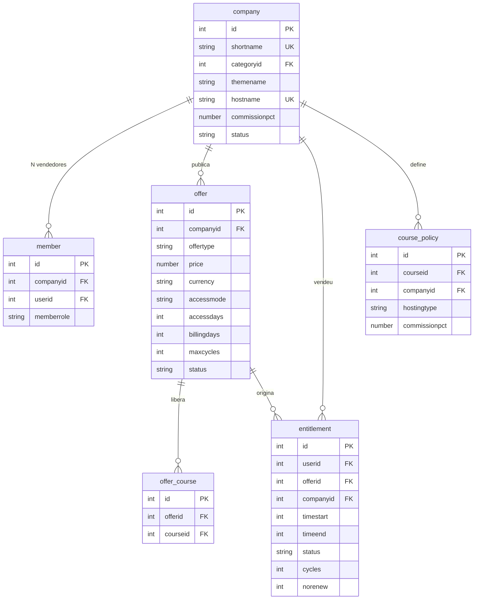

# Modelo de dados do marketplace

As tabelas dos cinco plugins, o que cada campo resolve, e as relações entre elas.

> Extraído de [`../dev/guia-desenvolvedor.md`](../dev/guia-desenvolvedor.md), que
> continua sendo o documento de referência para configuração, testes, domínio por
> vendedor e armadilhas.

---

## Modelo de dados

> **A credencial de pagamento não vive aqui.** Ela fica em
> `payment_gateways.config` do core, na conta de pagamento criada no contexto da
> categoria da empresa. Guardar uma cópia criaria duas fontes de verdade para uma
> credencial financeira — a tabela `local_marketplace_mpaccount` existiu e foi
> removida por isso.

## Tabelas, campo a campo

### `local_marketplace_company`

A empresa vendedora. Uma empresa = uma categoria de cursos.

| Campo | Para que serve |
|---|---|
| `shortname` | Único. Vira o `idnumber` da categoria e entra nas URLs da vitrine e do painel. **Não é editável** — trocar quebraria links já divulgados. |
| `categoryid` | Categoria provisionada na criação. É o contexto onde vivem o papel de vendedor e a conta de pagamento. |
| `themename` | Tema da categoria. Depende de `$CFG->allowcategorythemes`, garantido pelo `install.php`. Vazio limpa e volta ao tema do site. |
| `hostname` | Único. Domínio próprio do vendedor. Resolve pelo mapa gerado — ver *Domínio por vendedor* abaixo. |
| `commissionpct` | Comissão negociada, de 0 a 100. **Nulo herda o padrão do site** — nulo e zero são coisas diferentes. |
| `status` | `active` ou `suspended`. Não há aprovação manual: os portões são a conta de pagamento e o papel restrito. |

### `local_marketplace_member`

N vendedores por empresa; uma pessoa pode estar em várias.

| Campo | Para que serve |
|---|---|
| `memberrole` | `owner` ou `seller`. As capabilities são as mesmas — a distinção existe para impedir que a empresa fique sem responsável pela conta de pagamento. |

> **O vínculo são duas coisas inseparáveis.** Gravar a linha e atribuir o papel
> `marketplaceseller` no contexto da categoria. Só a linha produz alguém que
> consta como vendedor e não consegue fazer nada; só o papel produz alguém
> invisível ao marketplace. Use sempre `api::add_member()` e
> `api::remove_member()`.

### `local_marketplace_offer`

A unidade de **venda**. O curso deixa de ser o que se vende e passa a ser o que
se libera.

| Campo | Para que serve |
|---|---|
| `offertype` | `single` um curso · `bundle` conjunto escolhido · `catalog` tudo da categoria, com cursos novos entrando sozinhos. |
| `price` | Zero torna gratuita, e ofertas gratuitas não passam pelo Mercado Pago. |
| `currency` | Validada contra a moeda em que a empresa realmente recebe, descoberta da conta vinculada. |
| `accessmode` | `lifetime` · `days` · `recurring`. |
| `accessdays` | Quanto acesso **cada pagamento** libera. |
| `billingdays` | De quanto em quanto tempo se espera o próximo pagamento. Só em `recurring`. |
| `maxcycles` | Quantas cobranças a assinatura admite. `0` = sem limite. |

> **Por que `accessdays` e `billingdays` são separados.** Permitem carência:
> cobrar a cada 30 dias liberando 35 dá margem para o pagamento atrasar sem
> cortar o aluno. Se fossem o mesmo campo — como eram — a carência não existiria.
> E `maxcycles` é o que distingue "mensal por 12 meses" de "mensal enquanto
> quiser".

### `local_marketplace_entitlement`

O que o aluno comprou. Fonte da verdade do acesso.

| Campo | Para que serve |
|---|---|
| `companyid` | Desnormalizado de propósito: o acesso ao catálogo consulta por empresa a cada página. |
| `timeend` | `0` = vitalício. A vigência confere **a data além do status**: o status só muda quando o cron roda, e confiar nele daria acesso grátis na janela entre o vencimento e a próxima execução. |
| `status` | `active` · `expired` · `cancelled`. `cancelled` é **revogação imediata**, para estorno e fraude. |
| `cycles` | Quantas cobranças já foram pagas. Contado aqui e não na tabela do gateway, porque o limite é regra do marketplace: trocar de meio de pagamento não pode zerar a contagem. |
| `norenew` | O aluno cancelou a assinatura. **Não revoga** — o acesso corre até `timeend`, porque ele pagou por aquele período. Só interrompe os avisos. |

### `local_marketplace_course`

Política de hospedagem e comissão, por curso.

| Campo | Para que serve |
|---|---|
| `hostingtype` | `external` ou `platform`. Hoje só `external` é aceito — `platform` é recusado na validação até a decisão de negócio da Fase 5. |
| `commissionpct` | Percentual retido. Só se aplica em oferta de **curso único**. |

### `paygw_mercadopago`

Transações. Vive no plugin do gateway, não no marketplace.

| Campo | Para que serve |
|---|---|
| `externalreference` | A chave de ligação. O ID do pagamento só existe **depois** que o aluno paga, então precisamos de algo nosso acompanhando desde a criação da preferência. |
| `accountid` | Conta que recebe. É dela que sai o token para consultar o pagamento. |
| `feeamount` | `marketplace_fee` enviado. **Não é 25% do líquido**: a taxa do Mercado Pago sai antes e a comissão incide sobre o resto. |
| `status` | Espelha o Mercado Pago: `pending` · `approved` · `rejected` · `refunded` · `cancelled`. |
